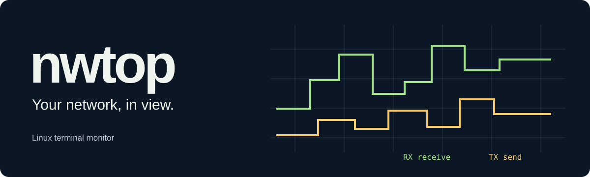
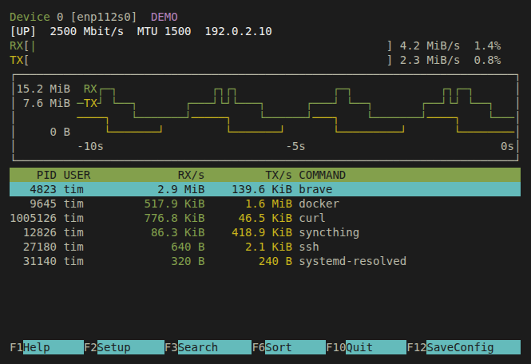

<p align="center">
  <a href="https://nettop.wutz.io">
    
  </a>
</p>

<p align="center">
  <strong>Linux network activity. Right in your terminal.</strong><br>
  Live traffic graphs, process rates, and F2 Setup — inspired by htop and nvtop.
</p>

<p align="center">
  
  <a href="Cargo.toml"></a>
  <a href="LICENSE"></a>
</p>

<p align="center">
  <a href="https://nettop.wutz.io">Website</a> ·
  <a href="#install">Install</a> ·
  <a href="#keyboard">Keyboard</a> ·
  <a href="https://github.com/itmitalles-de/nettop">Source</a>
</p>

**nettop** puts interface traffic, process activity, and individual connections
in one compact view. Green for receive, yellow for send, stepped history graphs,
and your terminal's own ANSI palette. The layout works in a split terminal,
including 36 × 16 and 52 × 18.

**Start without sudo after a one-time capture setup.** The interface runs as your
regular user; a separate helper provides the access needed for process traffic.
Interface counters also work without that setup.

<p align="center">
  
  <br>
  <sub>Actual terminal output in explicit DEMO mode. The displayed traffic is synthetic.</sub>
</p>

| At a glance | Under your control |
| --- | --- |
| **Traffic over time** | RX/TX history, link-speed bars, bytes or bits per second |
| **Processes and connections** | Sort by traffic, receive, send, total, PID, or command; search the table |
| **A familiar terminal UI** | Native colors, inverse headers, keyboard navigation, and a function-key bar |
| **F2 Setup** | Change the interface, refresh rate, graph, colors, and table; save with F12 |

## Install

You need **Linux**, **Rust 1.88+**, and the **libpcap runtime** for process capture.
A libpcap development package is not required. The source is public and
licensed under the [GNU GPL v3 or later](LICENSE); cloning does not require a
GitHub account.

```bash
# Ubuntu 24.04 and newer: capture runtime and capability tools.
sudo apt install libpcap0.8t64 libcap2-bin

git clone https://github.com/itmitalles-de/nettop.git
cd nettop
./scripts/install.sh
./scripts/setup-capture.sh       # One-time administrator authentication.
~/.local/bin/nettop
```

The installer builds from source and installs the UI into `~/.local/bin` as your
regular user. Add that directory to your `PATH`, then start with:

```bash
nettop
```

Older Debian/Ubuntu versions call the runtime package `libpcap0.8`. Without
libpcap or capture setup, use `nettop --no-capture` for interface counters and
accessible socket lists. Unavailable process rates appear as `-`.

<details>
<summary><strong>Installation, updates, and permissions</strong></summary>

`scripts/install.sh` runs `cargo build --release --locked`. It only replaces an
unchanged executable previously installed by that script; unrelated files,
symlinks, and modified executables are preserved.

`scripts/setup-capture.sh` also builds as your regular user. It requests
administrator authentication through `pkexec`, or `sudo` when `pkexec` is not
installed, only for installing `/usr/local/libexec/nettop-collector`. Start both
scripts without sudo. The package installation command above is separate from
this user-local build. **The administrator who authenticates trusts your
checkout:** the root phase runs this user-writable script and installs the binary
you built. It copies that build once into a root-only file without following a
symlink, verifies the digest of exactly that copy, and only then grants group
access and capabilities.

Run the UI installer again to update the UI. Repeat capture setup when updating
the helper; the UI installer never replaces the installed privileged helper.

The helper is owned by root, mode `0750`, and executable only by root and your
primary group. **Members of that group can monitor system-wide network
metadata.** Setup therefore refuses a primary group that is not your user private
group (named like your account), lists other members, or is the primary group of
another account, as with openSUSE's `users` or a directory's `domain users`. If
every member is trusted, rerun with `--allow-shared-group`. Only one group can
have access: when another group already has it, setup refuses to silently take
it over; `--reassign-group` moves access to your group and revokes the other.
Its file capabilities are `CAP_NET_RAW`, `CAP_DAC_READ_SEARCH`, and
`CAP_SYS_PTRACE`. After opening the capture socket, the capture thread drops all
capabilities; the sampling thread retains only the two needed to read
`/proc/PID/fd`. Both prevent gaining new privileges. Core dumps are disabled.

The UI has no capabilities. It starts the fixed helper over private stdin/stdout
pipes: no background service, listening port, or arbitrary file/command API.
Responses are bounded and interruptible, and the helper ends with its UI.
Containers and sandboxes can prevent capability acquisition even after setup;
nettop reports this instead of inventing traffic measurements.

`--no-capture` explicitly bypasses the helper. An administrator can revoke access
by removing `/usr/local/libexec/nettop-collector` and its receipt,
`/usr/local/libexec/.nettop-collector.sha256`.

</details>

### Optional extended attribution

For sockets that live less than one scan interval and container published ports,
opt in to socket lifecycle events, network namespace discovery and conntrack NAT
translation. The default build and its permissions are unchanged.

```bash
# Additional build/runtime dependencies on Ubuntu 24.04+.
sudo apt install clang libbpf-dev
./scripts/install.sh --extended-attribution
./scripts/setup-capture.sh --extended-attribution
```

This requires Linux with BTF and supported BPF tracing hooks, a little-endian
x86_64 or aarch64 target, and `libbpf.so.1`. The kernel integration tests use
Linux 6.8 on x86_64; other kernel configurations can reject the hooks. Missing
support, permissions, event losses and stale conntrack data are reported in
capture status instead of silently guessing ownership. F1 shows the active mode.
If neither optional backend can start, standard sampled attribution remains
available alongside the startup errors.

The extended helper additionally receives `CAP_BPF`, `CAP_PERFMON` and
`CAP_NET_ADMIN`. Its BPF worker drops all capabilities after attaching; its
conntrack worker retains only `CAP_NET_ADMIN` for subsequent netlink queries.
The UI stays unprivileged. No permanent service or pinned BPF objects are created;
closing nettop releases its probes. Run both installer scripts again without
`--extended-attribution` to return to the standard build and capability set.

Captured IP packets remain the only source of process byte counts. Event data
contains socket/process identities and endpoints, never payloads. Attribution
can be delayed by up to two seconds while late events arrive. Ambiguous owners,
shared descriptors, event loss and unsupported asynchronous I/O may still leave
traffic unattributed. This is monitoring, not complete per-process accounting.

In **All**, extended mode captures actual TCP/UDP IP packets at socket endpoints
across network namespaces, including foreign loopback, macvlan and ipvlan paths.
Each send/receive direction is counted at one endpoint capture point; bridge,
veth and VLAN copies do not multiply its bytes. A packet's kernel socket identity
supplies positive evidence even without conntrack, including queued receives on
long-lived NOTRACK sockets. Current descriptor evidence and ambiguity checks
still apply. A uniquely observed reader may receive credit after a descriptor
transfer; this does not claim historical ownership when the packet arrived.

These are observed IP skb bytes, not syscall payload counts or reconstructed
wire frames. Segmentation, receive aggregation, fragmentation and packets later
dropped after the capture point can make them differ from interface counters.
Pure forwarding has no local socket endpoint: select a host interface to inspect
its captured bytes. Non-TCP/UDP host captures remain unattributed in All.

A **selected interface** continues to use host libpcap with conservative socket
and conntrack correlation. Untracked queued traffic can remain unattributed in
that view; an absent mapping never proves absence of NAT. Identical packet
headers are not used to guess a socket across namespaces. Foreign loopback does
not appear under the host's loopback interface. Interface graphs always use the
host kernel counters, so their scope differs from cross-namespace process totals.
nettop neither enters namespaces nor changes firewall rules.

All packet hooks attach together or startup retains the existing capture path
with an explanation. A fatal runtime packet-backend failure makes All process
rates unavailable until restart, avoiding a switch that could double-count bytes.
Queues and history remain bounded. Capture-buffer pressure and attribution-wait
pressure have separate notices; the latter preserves already captured bytes and
any proven endpoint while ending the wait for remaining evidence.

## Use

```bash
nettop --interface eth0          # Select a network interface.
nettop --interface all           # Include virtual interfaces in the aggregate.
nettop --interval 0.5 --history 90
nettop --bits                    # Display rates in bits per second.
nettop --bytes                   # Override saved bit/s units.
nettop --no-color                # Start in monochrome.
nettop --no-capture              # Interface counters and accessible sockets.
nettop --once                    # Print one measured snapshot and exit.
nettop --json                    # Print a JSON snapshot and exit.
nettop --demo                    # Clearly labeled synthetic UI preview.
```

The default refresh interval is **1 second**; `--interval` / `-d` accepts
0.1–60 seconds. History defaults to **60 seconds**; `--history` accepts 10–600.
`-i` selects an interface and `-b` starts in bits per second.

## Keyboard

| Key | Action |
| --- | --- |
| <kbd>F1</kbd> / `?` | Help |
| <kbd>F2</kbd> | Open Setup |
| <kbd>F3</kbd> / `/` | Search the table |
| <kbd>F4</kbd> / `c` | Switch between processes and connections |
| <kbd>F5</kbd> / `i` | Choose an interface with arrows and Enter |
| <kbd>F6</kbd> | Choose a sort column; `s` cycles sorting |
| <kbd>F9</kbd> / Space | Pause or resume the display |
| <kbd>F12</kbd> | Save current settings |
| Tab / Shift+Tab | Cycle active interfaces and loopback |
| `b` | Toggle bytes / bits |
| ↑ / ↓, `k` / `j` | Move through the table |
| Page Up / Page Down, Home / End | Move by a page or jump to the ends |
| Enter / Esc | Apply search / clear search or close a picker |
| `q` / <kbd>F10</kbd> / Ctrl+C | Quit; `q` closes overlays and F10 returns from Setup |

Help scrolls with ↑ / ↓ and Page Up / Page Down. The table starts directly below
the graph; routine capture details live in F1 Help. Notices, search/filter state,
and capture warnings get a status row when needed.

### Make it yours with F2

Setup has **General**, **Interface**, **Chart**, and **Processes** panels. Change
the refresh interval, units, language, interface, history, Steps/Braille drawing,
RX/TX colors, view, sorting, and idle-row visibility. Hide the graph to give the
table more room.

The terminal interface is available in English and German. **Auto** follows
`LC_ALL`, `LC_MESSAGES`, or `LANG` (German for `de*` locales, otherwise English);
General › Language selects English or German explicitly. Command-line help,
errors, and `--json` output stay English.

Use ↑ / ↓ to navigate, Tab or → to enter the options, and ← to return to the
categories. Enter, Space, or `+` changes a value; `-` goes backward. Changes apply
immediately. **F10 or Esc returns to monitoring. F12 saves for the next start.**
Exiting without F12 keeps changes only for the current session.

<details>
<summary><strong>Settings file and command-line overrides</strong></summary>

Settings are saved atomically with private file permissions to
`$XDG_CONFIG_HOME/nettop/config.json`, or `~/.config/nettop/config.json` when
`XDG_CONFIG_HOME` is unset, empty, or relative.

Explicit CLI options override saved preferences for that run only. `--no-color`
and a nonempty `NO_COLOR` environment variable start in monochrome. F12 keeps the
saved values and adds only what you changed in Setup or with keys, so overrides
are saved only when you change that setting yourself.

Malformed or unsupported settings produce a warning and use defaults. Saving
preserves the original file until it is fixed or moved aside. Unknown keys, such
as typos, produce a warning and are kept when saving. If a saved interface no
longer exists, nettop warns and selects an interface automatically for that run;
the saved choice remains until you choose another one. Run nettop without sudo:
as root it refuses to save into another user's settings directory.

</details>

## What the numbers mean

Interface rates come from **kernel byte counters**. Process and connection rates
come from **captured TCP/UDP IP packets**, matched to socket inodes and PIDs.
Socket queue lengths are never used as traffic estimates.

Attribution has limits. Missing capture, dropped packets, and unattributed
traffic stay visible; unavailable measurements are never replaced with demo
data. Interface totals and process totals can differ.

<details>
<summary><strong>Measurement boundaries and privacy</strong></summary>

- Interface counters include protocols and link-layer overhead that captured
  TCP/UDP IP-byte totals do not. Interface totals are the kernel's cumulative
  counters; process totals contain observed captured IP bytes.
- Aggregating interfaces can count traffic more than once, for example across a
  bridge and its member interfaces. `--interface all` includes virtual links.
  Process rates there count host traffic once: copies seen on bridge ports, bond
  slaves or VLAN parents are left out, but still shown when that link is
  selected. Forwarded traffic can repeat in the unattributed row.
- Standard attribution covers accessible sockets in the host network namespace.
  The optional extended mode also correlates accessible container namespaces and
  conntrack NAT; its capture boundaries are described above.
- Standard socket ownership is sampled. Short-lived, shared, and ambiguously reused
  sockets can remain in the unattributed bucket; per-PID rates are not a complete
  accounting ledger. Equally matching `SO_REUSEPORT` sockets of one process
  credit that process, without a single connection row.
- Forwarded traffic is not assigned to unrelated host listeners. Multicast and
  broadcast receiver membership is not inferred from ports. IPv6 wildcard
  sockets are matched to IPv4 only when Linux socket diagnostics confirm
  dual-stack operation.
- Packet headers are interpreted; payloads are not logged. nettop does not
  perform DNS lookups.

</details>

## Development

nettop is written in Rust. Build and run the core checks with:

```bash
cargo fmt --check
cargo clippy --locked --all-targets -- -D warnings
cargo test --locked
cargo build --release --locked
shellcheck scripts/*.sh
python3 tests/terminal.py target/release/nettop
python3 tests/setup.py target/release/nettop
```

<details>
<summary><strong>Isolated capture tests and CI coverage</strong></summary>

Run capture and helper tests in an isolated environment. These Docker commands
use a read-only repository mount and a separate network namespace with no
external connectivity:

```bash
docker build -t nettop-test tests
docker run --rm --network none -v "$PWD:/work:ro" nettop-test \
  python3 tests/live_capture.py target/release/nettop
docker run --rm --network none --cap-add DAC_READ_SEARCH --cap-add SYS_PTRACE \
  -v "$PWD:/work:ro" nettop-test python3 tests/helper.py --isolated \
  target/release/nettop target/release/nettop-collector
```

The Python integration tests use standard-library loopback sockets. Separate
sender and receiver PIDs exchange real IPv4/IPv6 TCP and UDP traffic; assertions
cover measured rates, PID attribution, packet drops, and duplicate counting
without changing network configuration. `tests/helper.py` also checks capability
separation, unprivileged cross-user attribution, installer safeguards, bounded
protocol input, shutdown with a stopped helper, helper cleanup when the
terminal closes, and the fallback to direct counters when the helper stops
answering.

[CI](.github/workflows/ci.yml) is configured to run formatting, linting, unit
tests on stable and Rust 1.88.0, release builds, terminal restoration, prompt exits after the terminal closes, Setup and
persistence checks, a dependency audit, and capture tests in isolated, digest-pinned
Ubuntu 24.04 containers.
Building the test image needs access to its base image and package repositories.

</details>

See [AGENTS.md](AGENTS.md) for repository-specific contributor instructions.

The [project website](https://nettop.wutz.io) is a dependency-free static site in
[`site/`](site/), published by the [Pages workflow](.github/workflows/pages.yml).
Its terminal images and recording use explicit DEMO mode with synthetic traffic.

## License

Copyright (C) 2026 itmitalles

nettop is free software: you can redistribute it and/or modify it under the
terms of the GNU General Public License as published by the Free Software
Foundation, either version 3 of the License, or (at your option) any later
version (SPDX: `GPL-3.0-or-later`). nettop is distributed in the hope that it
will be useful, but WITHOUT ANY WARRANTY; without even the implied warranty of
MERCHANTABILITY or FITNESS FOR A PARTICULAR PURPOSE. See [LICENSE](LICENSE) for
the full license text.

---

[GPL-3.0-or-later](LICENSE) · Inspired by htop and nvtop · No affiliation with other
projects named nettop or ntop.
